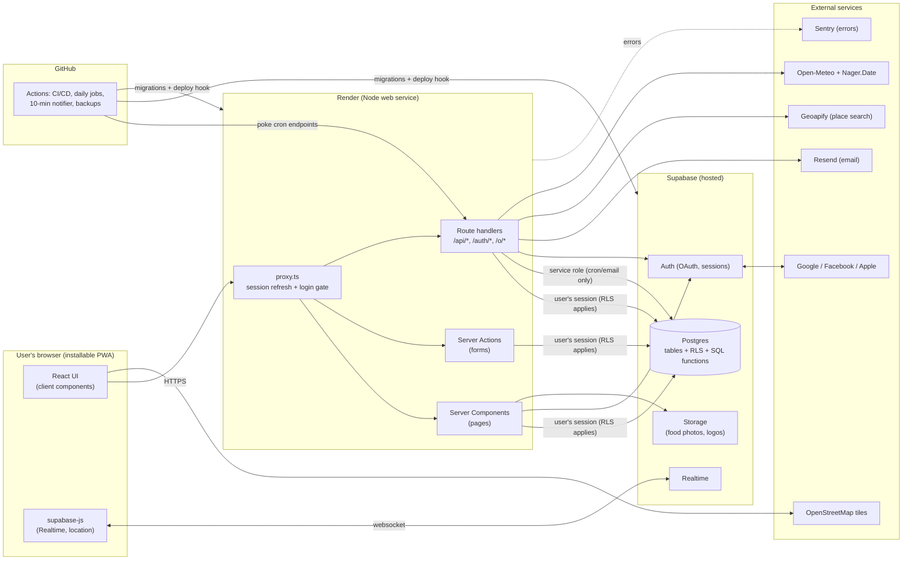
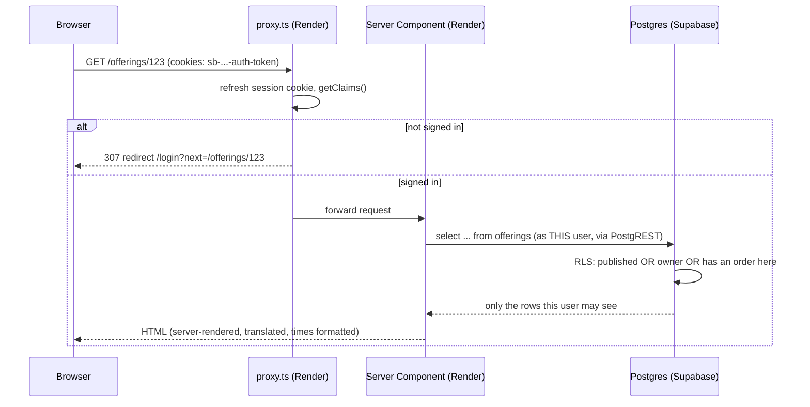
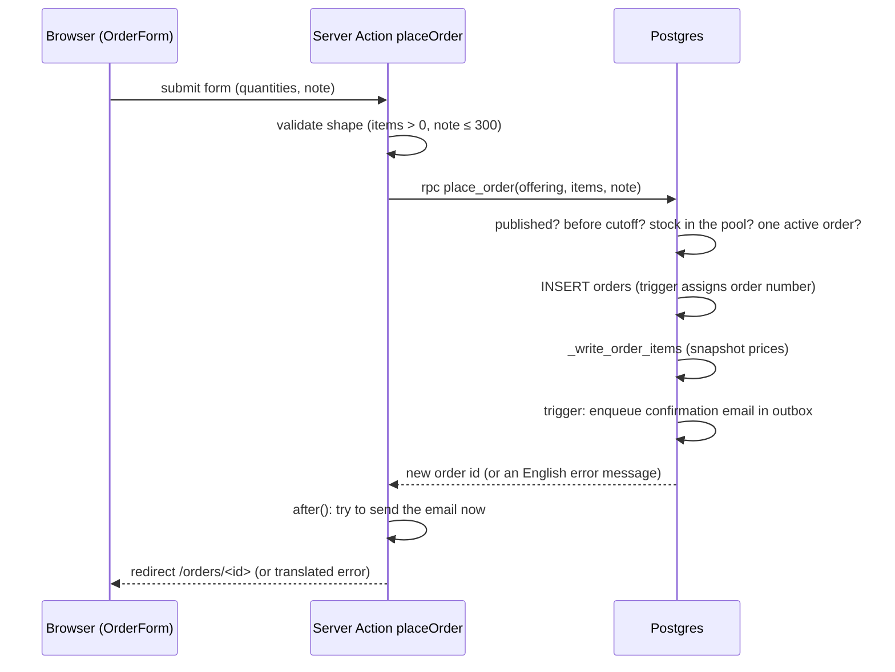

# 01 · System overview

Goal of this document: after reading it you can draw the system on a whiteboard, trace one request from a tap in the browser to a row in Postgres and back, and name every external service.

## 1. The components

**Read the diagram as three tiers plus helpers:** the *browser* shows UI; *Render* runs our Next.js code; *Supabase* stores data and enforces rules; everything else is an optional helper. GitHub Actions is our scheduler and deploy robot.

## 2. Who uses it (actors)

| Actor | What they do | Where in the app |
| --- | --- | --- |
| **Visitor (anonymous)** | Can only see: login, privacy/terms, the public *share page* of an offering a merchant chose to share, health check, email unsubscribe | `lib/public-paths.ts` is the full list |
| **Customer** | Browse merchants, view an offering, order/edit/cancel before cutoff, see order total and QR, view history | `/`, `/merchants/[id]`, `/offerings/[id]`, `/orders`, `/orders/[id]` |
| **Merchant** | Manage profile, foods, pickup points, offerings; see orders, prep list and totals; scan QR; share live location; reports | `/merchant/**` |
| **System jobs** | Weather/holiday snapshot, due-email queueing + sending, DB backups, stale-location wipe | `app/api/cron/*`, `.github/workflows/*` |

There is **no admin console** yet: operators use the Supabase dashboard and GitHub.

## 3. One request, end to end: "customer opens an offering page"

What to notice:
1. `proxy.ts` (formerly "middleware" before Next.js 16) runs **before** every page. It refreshes the login cookie and redirects strangers. It is a convenience gate, **not** the security boundary.
2. The server component talks to Supabase **with the user's own session**, so Postgres knows who is asking and applies **row-level security**. Even a bug in our page cannot reveal another merchant's data.
3. The page is rendered on the server (fast first paint, works with weak phones, link previews possible). Only small interactive parts are client components.

## 4. One write, end to end: "customer places an order"

The server action **never decides** whether the order is allowed. It asks the database, which is the single place the rules live. See [07 Core flows](07-core-flows.md).

## 5. The three ways code talks to Supabase

| Client | File | Runs where | Rights | Use for |
| --- | --- | --- | --- | --- |
| Browser client | `lib/supabase/client.ts` | Browser | The signed-in user (anon key + their session) | Realtime live-map subscription, reading the location row |
| Server client | `lib/supabase/server.ts` | Server components/actions/route handlers | The signed-in user, session read from cookies | **Almost everything** |
| Admin client | `lib/supabase/admin.ts` | Server only | **Service role: bypasses RLS** | Cron jobs, sending emails, deleting an account, clearing stale locations |

Rule: reach for the server client. The admin client exists for work that has no signed-in user. Never import it into a client component.

## 6. Repository map (where things live)

| Path | What |
| --- | --- |
| `app/` | Next.js routes (pages, server actions, route handlers) |
| `components/` | Reusable UI (forms, order form, live map, share tools…) |
| `lib/` | Pure helpers and adapters: formatting, money, locale, places, notifications, supabase clients |
| `messages/` | UI strings, one JSON per language |
| `content/legal/` | Privacy policy and terms as structured data in 4 languages |
| `supabase/migrations/` | **The schema, security rules and business rules** (numbered SQL files) |
| `supabase/seed.sql`, `config.toml` | Local dev data and local Supabase settings |
| `tests/db`, `tests/integration`, `tests/e2e`, `lib/__tests__` | The four test layers ([09](09-testing-quality.md)) |
| `.github/workflows/` | CI/CD and scheduled jobs ([06](06-hosting-deployment-ci.md)) |
| `docs/` | Everything you are reading |

## 7. Technology at a glance

| Concern | Choice | Detail |
| --- | --- | --- |
| Language | TypeScript (strict) | [02](02-tech-stack-and-alternatives.md) |
| Web framework | Next.js 16 (App Router), React 19 | [02](02-tech-stack-and-alternatives.md) |
| Styling | Tailwind CSS 4 | [02](02-tech-stack-and-alternatives.md) |
| Validation | Zod 4 | [02](02-tech-stack-and-alternatives.md) |
| i18n | next-intl (cookie/Accept-Language, no URL prefix) | [02](02-tech-stack-and-alternatives.md), [`../i18n.md`](../i18n.md) |
| Database + auth + realtime + files | Supabase (Postgres 17, GoTrue, Realtime, Storage) | [03](03-database-supabase.md) |
| Login | OAuth via Google, Facebook, Apple (GitHub supported) | [04](04-authentication-oauth.md) |
| Hosting | Render (web), Supabase (data) | [06](06-hosting-deployment-ci.md) |
| CI/CD, cron, backups | GitHub Actions | [06](06-hosting-deployment-ci.md) |
| Email | Resend (HTTPS API) with an outbox table | [08](08-integrations.md) |
| Maps / place search | Leaflet + OpenStreetMap tiles, Geoapify search | [08](08-integrations.md) |
| Errors / uptime | Sentry, external uptime monitor on `/api/health` | [08](08-integrations.md) |
| Tests | Vitest, PGlite, live-Supabase integration, Playwright | [09](09-testing-quality.md) |

## 8. Questions to check your understanding

1. Why does the customer-facing server component not need to check "is this offering published?" itself?
2. If someone steals the anon key from the browser bundle, what can they do? What would be catastrophic to leak instead?
3. Which three places could stop an order after the cutoff, and which one is authoritative?
4. Why is `proxy.ts` not considered the security boundary?

*(Answers: 1 — RLS on `offerings`; 2 — only what RLS allows an anonymous/own-session caller to do, versus the service-role key which bypasses all rules; 3 — the page (it hides the order form once the cutoff has passed), the server action, and the `place_order` SQL function, with SQL authoritative; 4 — it can be misconfigured or skipped, and data access is protected by the database regardless.)*
