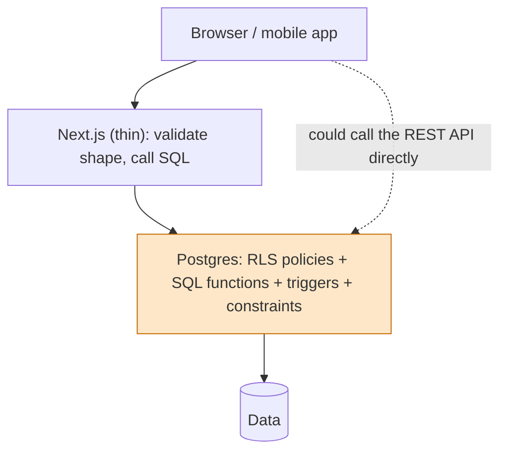
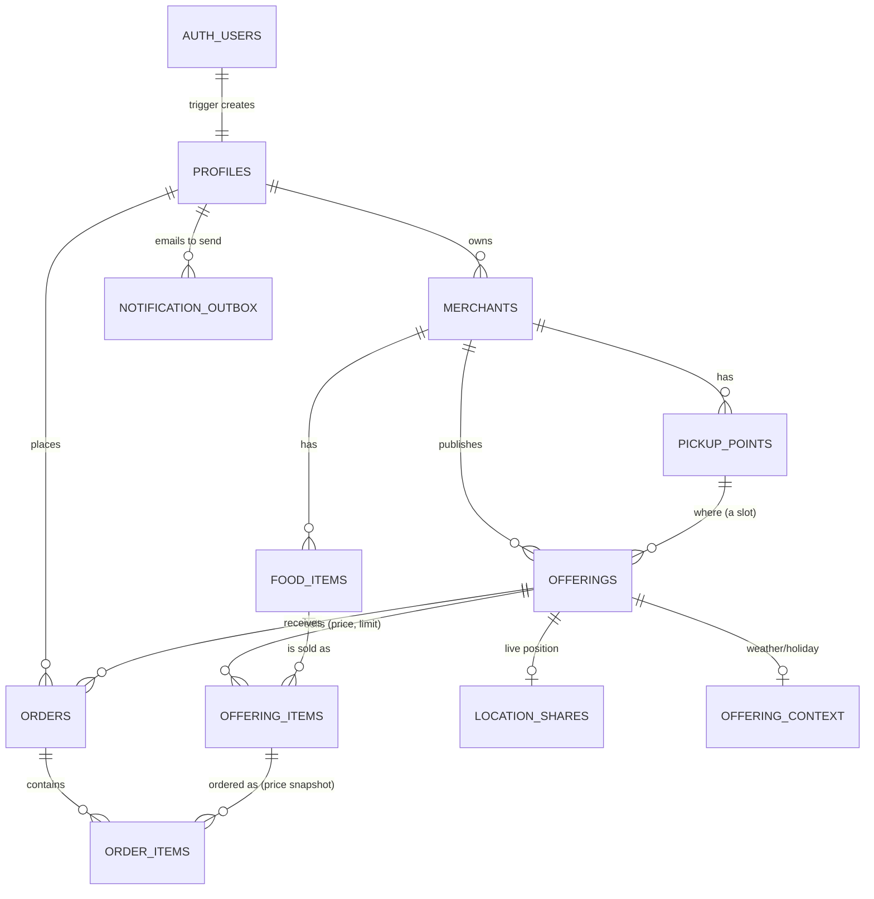
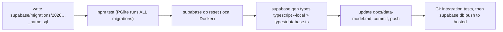

# 03 · Database and Supabase

This is the most important document: **the database is where the business rules live.** If you understand this one, the rest of the app is easy to follow.

## 1. What Supabase is

Supabase is an open-source "backend in a box" built around **PostgreSQL**. One project gives us:

| Piece | What it does for us | Underlying tech |
| --- | --- | --- |
| **Postgres** | Stores everything: users' profiles, merchants, offerings, orders… and enforces the rules | PostgreSQL 17 |
| **Auto-generated REST API** | `supabase-js` reads/writes tables over HTTPS without us writing endpoints | PostgREST |
| **Auth** | Social login, sessions, JWTs, the `auth.users` table | GoTrue |
| **Realtime** | Pushes row changes to browsers over a websocket (live merchant location) | Realtime server |
| **Storage** | Files (food photos, logos) with policies, behind public URLs | S3-compatible object store + Postgres policies |
| **Studio / CLI** | Dashboard, `supabase start` for a local copy, `supabase db push` to migrate | Docker, CLI |

Two environments: **local** (`supabase start`, Docker; used for development and tests) and **hosted** (a free-tier project; production). The same migration files build both.

## 2. Why Supabase here

The product is **relational** (merchants → offerings → items → orders → lines), needs **strict integrity** (don't oversell, don't lose orders), **who-can-see-what rules** (merchants must never see each other's customers), **social login**, a bit of **realtime**, **file storage**, and a **free tier**, and may get a **mobile app** later.

| Need | How Supabase meets it |
| --- | --- |
| Relational integrity and money-like correctness | Real Postgres: foreign keys, unique/partial indexes, CHECK constraints, transactions |
| "Who can see what" without writing an authorization layer | **Row-Level Security** (RLS): policies attached to tables, applied to every query automatically |
| Rules that cannot be bypassed from a browser | SQL functions (`place_order`) and triggers inside the database |
| Social login with sessions | Built-in Auth providers (Google, Facebook, Apple, GitHub…) |
| Live map | Realtime on the `location_shares` table, filtered by RLS |
| Photos | Storage buckets with per-folder policies |
| Mobile later | The same REST API + RLS works from a native app with only the **public** key |
| Cost | Free tier for a pilot; paid Pro plan when needed |

## 3. Pros and cons

**Pros**
- It is **just Postgres**. Skills and data are portable; you can `pg_dump` out and run anywhere.
- RLS puts authorization next to the data; one mistake in a page cannot leak rows.
- Much less code: no auth server, no REST layer, no websocket server, no file server.
- Good local story: the whole stack runs in Docker; migrations are plain SQL files in git.
- Open source, so self-hosting is possible if the hosted service stops fitting.

**Cons / risks**
- **Free-tier limits** (see [06](06-hosting-deployment-ci.md)): projects pause after ~7 days of inactivity (our daily job and uptime monitor prevent that), no automatic backups on free (we run our own encrypted dump), small database.
- **SQL and RLS are a learning curve** and are easy to get subtly wrong. Policies compose in non-obvious ways; testing is mandatory (we run the real migrations in PGlite, see [09](09-testing-quality.md)).
- **Local and hosted differ** in small but real ways (we hit these: the `pgcrypto` function lives in an `extensions` schema on hosted; the direct DB host is IPv6-only on free, so CI uses the pooler; the REST root answers differently). Always test against the hosted project before trusting a new endpoint.
- **Partial lock-in** on the non-Postgres parts: Auth (GoTrue) and Realtime/Storage APIs are Supabase-specific. Moving away means replacing those, not the data.
- **Logic in SQL** is harder for some developers to read/debug than TypeScript, and needs migration discipline.

## 4. Alternatives considered

| Alternative | What it is | Why it could be better | Why we did not choose it |
| --- | --- | --- | --- |
| **Firebase (Firestore + Auth)** | Google's NoSQL backend | Great realtime and mobile SDKs, very mature auth | NoSQL makes relational rules (stock across slots, unique active order, joins/reports) awkward; security rules are a different language; stronger vendor lock-in; weaker SQL reporting |
| **Plain Postgres + custom API** (Express/Fastify/NestJS + Prisma/Drizzle) | You write the backend | Total control, any host, familiar to many teams | Much more code to write, secure and operate (auth, sessions, API, realtime, files); the free path is harder |
| **Neon / PlanetScale / RDS + Auth0 / Clerk / Cognito** | Managed DB plus separate auth service | Best-of-breed pieces; serverless branching (Neon) | Several vendors/bills/integrations; lose RLS-with-JWT simplicity unless we rebuild it |
| **AWS Amplify / AppSync** | AWS full-stack | Deep AWS integration, enterprise features | Heavy, steep learning curve, cost surprises for a pilot |
| **PocketBase** | Single-binary backend (SQLite) | Tiny, very simple, self-hosted | SQLite limits for concurrent writes/realtime scale; smaller ecosystem; you operate it |
| **Appwrite** | Open-source BaaS | Similar bundle, self-hostable | Less SQL-native; we wanted real Postgres |
| **Convex / other reactive backends** | TypeScript-first reactive DB | Excellent developer experience for realtime | Proprietary data model; less suitable for SQL reporting and strict relational rules |
| **Django/Rails + Postgres** | Batteries-included frameworks | Admin UI, ORM, auth in the box | Two languages with the React Native plan; hosting a long-running server anyway |

**Exit strategy:** the schema is plain SQL in `supabase/migrations/`; data can be dumped (`supabase db dump`, see backups in [`../backup-restore.md`](../backup-restore.md)). Replacing Auth and Realtime is the real work (see [04](04-authentication-oauth.md) for how isolated auth is).

## 5. The core design principle: rules in the database



If a rule lives only in TypeScript, then every client (web, a future mobile app, a script, someone with the public key and `curl`) must re-implement it correctly. If it lives in Postgres, **every path goes through it**. Our rules in SQL today include:

- the ordering cutoff, stock limits (shared across slots), one active order per customer and offering;
- who can read/write which rows (merchant isolation, customers see only their own orders and offerings they ordered from);
- pickup confirmation (QR token must belong to *your* merchant);
- editing protections (cannot move an offering with orders, cannot lower a limit below what was ordered, cannot delete an offering with orders);
- live location (only on the pickup day, only fresh data, only to customers who ordered);
- numbering (`m00001-000001-000001`), price snapshots, email outbox queueing.

Cost: SQL skills and careful testing. Benefit: the app can have bugs without breaking the rules.

## 6. Row-Level Security (RLS), explained from zero

Normally a database trusts whoever connects. With RLS you attach **policies** to a table: SQL conditions evaluated for every row of every query, using the identity in the request's JWT (`auth.uid()`). Rows failing the policy are simply invisible (select) or rejected (write).

Example from the schema:

```sql
-- A customer sees only their own orders...
create policy orders_customer_read on orders for select using (customer_id = auth.uid());
-- ...and a merchant sees orders placed on their offerings.
create policy orders_merchant_read on orders for select
  using (is_merchant_owner(offering_merchant(offering_id)));
```

Why this is powerful: `select * from orders` run by Alice returns Alice's orders; run by a merchant returns orders on their offerings; run by an anonymous visitor returns nothing. **The page code is identical.**

Things to remember:
1. RLS is **enabled per table**. A table with RLS on and *no policy* denies everything (we use this for server-only tables such as `notification_outbox` and the number counters).
2. Policies combine with **OR** per command (any matching policy allows) - be careful when adding one.
3. The **service-role key bypasses RLS** entirely (used only by trusted server jobs).
4. Views need `security_invoker = true` to respect the caller's RLS (`order_lines` does).
5. **Storage** has its own policies on `storage.objects`.
6. Policies that call other tables can recurse; we use `security definer` helper functions (`is_merchant_owner`, `has_order_on`, `has_order_in`) to avoid that and keep policies readable.

## 7. SQL functions (RPCs), triggers and constraints

| Tool | Use it for | Examples here |
| --- | --- | --- |
| **CHECK / UNIQUE / FK / partial unique index** | Facts that must always be true | one active order per customer+offering (`unique … where status <> 'cancelled'`), `price_cents >= 0`, `order_no` unique |
| **Trigger** | "Whenever a row changes, also do/check this" | `check_offering_schedule` (cutoff before pickup in the pickup point's timezone), `assign_order_number`, `protect_offering_changes`, `handle_new_user` (create a profile on first login), enqueue email |
| **SQL function called by the app (RPC)** | Multi-step operations that must be atomic | `place_order`, `update_order`, `cancel_order`, `confirm_pickup`, `update_offering`, `add_offering_slot`, `change_order_slot`, `set_offering_sharing`, `get_shared_offering` |

**`security definer` vs invoker.**
- *Invoker* (default): the function runs with the caller's rights; RLS applies inside it. Used where the caller owns the data (`update_offering`).
- *Definer*: runs with the function owner's rights. Needed when the function must look at rows the caller cannot read (stock across other customers' orders; checking another table in a policy; the public share whitelist). **Every definer function sets `search_path = public`** to avoid search-path hijacking, and grants execute only to the roles that need it (`revoke … from public, anon`; `grant … to authenticated`).

**Atomicity.** A function runs in one transaction: `place_order` either writes the order and all lines or nothing. Concurrency-sensitive sections use locks (`for update`, `for share`, and the counter upserts that lock one row).

**Evolving functions safely** (see [`../decisions.md`](../decisions.md)): add parameters with defaults so older clients (the website mid-deploy, a future old mobile build) keep working; `null` = "unchanged", empty string = "clear".

## 8. Data model at a glance



Important modelling choices (full table reference: [`../data-model.md`](../data-model.md)):

- **Slots are offering rows.** An offering with three pickup places is three `offerings` rows sharing `group_id` and `offering_no`. That way orders, QR codes, reports, reminders and live location all stay *per slot* with no change; only stock, cutoff, foods and prices are kept in step across the group (`offering_pool`, `update_offering`).
- **Price belongs to the offering item**, never to the food; each order line **snapshots** the unit price.
- **Human IDs** (`m00001`, `m00001-000001`, `m00001-000001-000001`) are separate from UUID primary keys; assigned by triggers from counters in tables nobody can read.
- **Translations** are `jsonb` columns on the row (`{"es": {"name": "…"}}`), original text in the normal column.
- **Roles are implicit:** you are a merchant if you own a `merchants` row.
- **Timestamps** are `timestamptz` (absolute instants); dates/times for pickup are *wall-clock at the pickup point's timezone*.

## 9. Migrations workflow



Rules:
1. **Never edit a migration that has been applied** to the hosted project: add a new numbered file. (Early on, while a migration was still only local, we edited it; once pushed, it is immutable.)
2. A migration can rewrite functions with `create or replace` (we did this several times for `update_offering`); check whether grants survive (they do for `create or replace`, not for `drop function`).
3. Backfills belong in the migration (see the numbering migrations, tested against old data with `createDb({ stopBefore })`).
4. Avoid depending on extension functions or non-`public` schemas (hosted `search_path` differs).
5. The seed (`supabase/seed.sql`) is **local only**.

## 10. Storage (photos and logos)

Bucket `food-images` is **public-read** (listings are public), JPEG only, 1 MiB max. A file may be written only under `"<merchant_id>/…"` by that merchant's owner (policy helper `is_food_image_owner`). The path (not a URL) is stored on the row, so URLs survive a project move. Uploads are re-encoded in the browser, then **EXIF/GPS and all metadata are stripped again on the server** before storing ([05](05-security-and-privacy.md)). Database cascades do not delete files, so account deletion removes the folder explicitly. Merchant **logos** reuse the same bucket and folder (`logo-<random>.jpg`).

## 11. Realtime

Only `location_shares` is published (`alter publication supabase_realtime add table …`). The customer's map subscribes to changes filtered by offering; **RLS decides whether they receive the row** (active + fresh + they have an order). We also poll every 30 s because the database stops returning stale positions (a changed *visibility* does not always produce an event).

## 12. Type generation

`types/database.ts` is generated from the local database (`supabase gen types typescript --local`). It types every table, view and RPC argument. After any migration: regenerate, then run `npm run typecheck`; mismatches show up immediately (for example when we added `offering_no` or `price_cents`).

## 13. Hosted-vs-local pitfalls (real incidents)

| Incident | Cause | Lesson |
| --- | --- | --- |
| `gen_random_bytes does not exist` on hosted `db push` | pgcrypto is in the `extensions` schema there | Use core functions (`gen_random_uuid`) in migrations |
| CI could not connect to the DB | GitHub runners are IPv4; direct DB host is IPv6-only on free | Use the **session pooler** connection string |
| `/api/health` false 503 | REST root answers 401 on hosted, 200 locally | Probe with a real table query; test endpoints against hosted |
| Account deletion cascade failed | FK cascade order (merchant → foods before offerings) | Guard/order cascades with triggers; test against the real auth service |
| Cascade opened a hole | `ON DELETE CASCADE` let an owner delete others' orders via the API | Protect destructive cascades with triggers (`protect_offering_delete`) |

## 14. Practical exercises

1. Open `supabase/migrations/20261003000000_init.sql` and find every policy on `orders`. Predict what a customer, a merchant and an anonymous visitor each get from `select * from orders`.
2. Read `_write_order_items` in the latest migration. Which locks/conditions prevent overselling when two customers order the last item at once?
3. In `tests/db/pickup-slots.test.ts`, find the test that proves stock is shared across slots. Break the rule on purpose (comment a line in the migration copy) and watch the test fail.
4. Run `supabase start`, open Studio (printed URL), and try the policy tester: query `orders` as different users.
