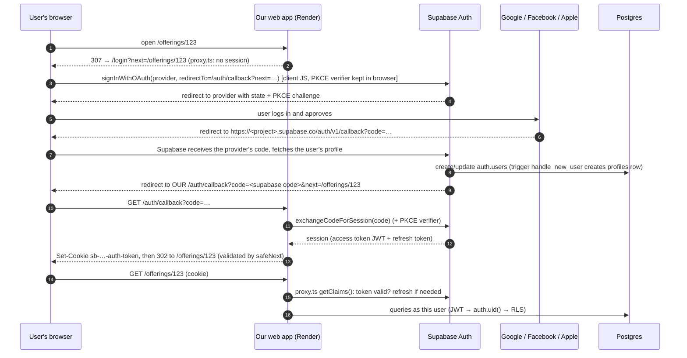

# 04 · Authentication and OAuth (social login)

**Authentication** = proving who you are. **Authorization** = deciding what you may do. Here, *authentication* is delegated to Google / Facebook / Apple through **OAuth**, handled by **Supabase Auth**; *authorization* is done by the database (RLS, see [03](03-database-supabase.md)).

## 1. What the user experiences

1. Visit any page → not signed in → redirected to `/login?next=<where you wanted to go>`.
2. Tap "Continue with Google" (or Facebook / Apple) → the provider's own screen → approve.
3. Land back on the page you wanted. A `profiles` row now exists with your name and photo.

There is no password field, no "forgot password", no email-verification step anywhere.

## 2. Vocabulary (OAuth 2.0 / OpenID Connect in plain words)

| Term | Meaning | In our system |
| --- | --- | --- |
| **Resource owner** | The person who owns the account | The customer/merchant |
| **Identity provider (IdP)** / authorization server | The service that knows the user and asks "allow this app?" | Google, Facebook, Apple |
| **Client** | The app asking for sign-in | **Supabase Auth** is the OAuth client of Google/Facebook/Apple; **our web app** is the client of Supabase |
| **Authorization code** | A one-time, short-lived code returned via redirect | Exchanged for tokens on the back channel |
| **PKCE** | A secret "verifier" proving the app that *started* the login is the one *finishing* it | Used in our flow; defeats stolen-code attacks |
| **Redirect URI** | Where the provider sends the user back | Must match **exactly** what is registered (the classic source of setup bugs) |
| **Scopes** | What information we ask for | Basic profile + email (no extra Google/Facebook permissions) |
| **ID token / access token / refresh token** | Proof of identity / short-lived API pass / long-lived renewal pass | Supabase turns them into **its own session JWT** + refresh token |
| **OIDC** | OpenID Connect: OAuth plus a standard "who is this user" answer | Google/Apple are OIDC; Facebook is OAuth with its own profile API |
| **JWT** | A signed token containing claims (user id, role, expiry) | The `sub` claim is `auth.uid()` in SQL policies |

## 3. The flow, step by step

**Why two redirects?** The provider only knows *Supabase's* callback URL (`https://<ref>.supabase.co/auth/v1/callback`). Supabase then redirects to *our* `/auth/callback`, where our server exchanges the one-time code for a session cookie. This is the standard "backend as OAuth broker" pattern.

**Files**
| Step | File |
| --- | --- |
| Login buttons, `signInWithOAuth` | `app/login/login-buttons.tsx` (providers shown come from `NEXT_PUBLIC_AUTH_PROVIDERS`) |
| Code → session, redirect, language sync | `app/auth/callback/route.ts` |
| Cookie refresh + login gate on every request | `proxy.ts` → `lib/supabase/proxy.ts` (`getClaims()`) |
| Server-side user lookup in pages/actions | `lib/auth.ts` (`requireUser`, `requireMerchant` use `getUser()`) |
| Sign out | `app/auth/signout/route.ts` (POST) |
| Profile row on first login | SQL trigger `handle_new_user` on `auth.users` |
| Safe redirects | `safeNext()` in `lib/auth.ts` (only same-site relative paths) |
| Public (no login) paths | `lib/public-paths.ts` |
| Local provider config | `supabase/config.toml` (`[auth.external.*]`, credentials via `env(...)`) |
| Setup guide per provider | [`../social-login-setup.md`](../social-login-setup.md) |

## 4. Sessions and cookies

- After login the browser holds cookies named `sb-<project>-auth-token` (chunked if large), managed by **`@supabase/ssr`** so that **server components can read the session**. Cookies are what let a server-rendered page know who you are.
- The **access token** is a short-lived JWT (about an hour); the **refresh token** renews it. `proxy.ts` refreshes the cookie on navigation, and the cookie is written back to the response.
- `getClaims()` (proxy) checks the token cheaply; `getUser()` (pages/actions) asks Supabase Auth to confirm the user. Use `getUser()` when you must be sure the account still exists.
- Server components cannot always *set* cookies (they render during a response), which is why the session refresh lives in `proxy.ts`.

## 5. Why OAuth/social login?

### Pros
- **No passwords to store, leak, reset or rate-limit.** The scariest class of auth bugs disappears.
- **Lowest friction:** customers already have a Google/Facebook/Apple account; one tap.
- **Provider-grade security** (their MFA, risk detection, breach monitoring) for free.
- A verified name/photo (and usually email) without building profile screens.
- Required for a good mobile experience (Sign in with Apple, "Continue with Google").

### Cons
- **Dependency on third parties:** if a provider has an outage or changes terms, those users cannot sign in. (Mitigation: offer several providers.)
- **Setup work and review:** each provider needs a developer app, redirect URIs, privacy-policy URL; **Facebook** apps must be switched to *Live*; **Apple** costs $99/year and its client secret **expires at least every 6 months** (calendar reminder: roadmap OPS-11).
- **Email may be missing or private:** Facebook users may have no email; Apple's "Hide my email" gives a relay address. We therefore never *require* an email, and emails are only sent when one exists.
- **Account recovery is the provider's problem** (good) but also means we cannot help someone locked out of their Google account.
- **Users who dislike social login** (privacy) have no alternative yet.
- **Testing is harder:** you cannot automate a real Google login in CI. We create password users through the **admin API** in tests and copy their session cookies into the browser (`tests/e2e/helpers.ts`).

### Alternatives considered

| Alternative | How it works | Pros | Cons | Verdict |
| --- | --- | --- | --- | --- |
| **Email + password** | We store (hashed) passwords | Familiar; no third party | Password resets, breach liability, weak passwords, email verification, bots | Rejected: most risk, most code |
| **Magic link (email)** | Click a link in an email | No password; simple | Needs reliable email delivery (Render blocks SMTP on free; deliverability work), slow on mobile (switch to mail app) | Possible later as a *fallback* |
| **SMS one-time code** | Code to phone | Familiar to some; phone as identity | Cost per SMS, carrier delivery issues, SMS-pumping fraud, privacy of phone numbers | Rejected for v1 |
| **Passkeys / WebAuthn** | Device biometric credential | Phishing-resistant, passwordless | Recovery/UX still maturing, cross-device sync complexity | Good future option |
| **Hosted auth vendor** (Auth0, Clerk, Cognito, Firebase Auth) | Separate auth service | Rich features, pre-built UI | Another vendor/bill; JWT must still be wired into the database for RLS (Supabase does this natively) | Rejected: Supabase Auth already bundled |
| **Auth.js (NextAuth) / Lucia in the app** | Library in our server | Full control, no vendor | We would run sessions ourselves and map identity into Postgres RLS by hand | Rejected: more code, weaker RLS integration |
| **Self-hosted Keycloak / Authentik** | Own identity server | Enterprise SSO, full control | Operate and secure another service | Overkill |

## 6. The providers

| Provider | Status | Notes |
| --- | --- | --- |
| **Google** | ✅ shown | Easiest. Publish the consent screen from *Testing* to *In production* to allow anyone |
| **Facebook** | ✅ shown | Needs a privacy-policy URL (we serve `/privacy`) and *Live* mode; users sometimes have no email |
| **Apple** | ✅ shown | Paid developer account, HTTPS, secret expiry ≤ 6 months. **App Store rule (guideline 4.8):** an iOS app offering other social logins must offer Sign in with Apple |
| **GitHub** | supported, not shown by default | Developer audience; enable by adding `github` to `NEXT_PUBLIC_AUTH_PROVIDERS` |
| **Instagram** | ❌ not possible | Meta shut the basic-display API (Dec 2024); remaining API is for business/creator accounts, cannot identify customers |
| **Yahoo** | ⚠️ possible via custom OIDC | Not built in to Supabase; see the guide |

Environment/redirect gotchas we hit: Supabase **Site URL** and **Redirect URLs** must include the production `/auth/callback`; behind Render's proxy `request.url` shows an internal address, so redirects use `publicOrigin()` ([`../decisions.md`](../decisions.md)).

## 7. Authorization after login

- **Roles are implicit**: owning a `merchants` row makes you a merchant (`requireMerchant()` redirects to `/merchant/setup` otherwise). A person can be both customer and merchant.
- All data access runs as the user, so **RLS** decides visibility ([03](03-database-supabase.md)).
- **Account deletion** (required by app stores and privacy law): server action `deleteAccount` confirms the user typed `DELETE`, refuses while a merchant has upcoming active orders, deletes the merchant's photos, then deletes the auth user with the admin API; database cascades remove the rest.

## 8. Security checklist for auth code

- [ ] Redirect targets pass `safeNext` (prevents open redirects: `?next=https://evil.example`).
- [ ] Never build redirect URLs from `request.url` in route handlers behind a proxy: use `publicOrigin()`.
- [ ] Only the **anon** key is ever sent to the browser; the **service-role** key stays on the server.
- [ ] Server Actions are same-origin-checked by Next; do not weaken `Origin` handling.
- [ ] State-changing routes use POST (sign-out, unsubscribe, location stop).

## 9. Exercises

1. Trace a login using the browser's network tab: find the redirect to `…supabase.co/auth/v1/callback`, then to our `/auth/callback?code=…`.
2. Why does the callback route call `syncLocale`? (So a returning user gets their language on a new device.)
3. What happens if you open `/auth/callback?code=bad`? (Redirect to `/login?error=auth`.)
4. In `tests/e2e/helpers.ts`, see how `signIn` produces cookies without OAuth. Why is this acceptable for tests, and what does it *not* test?
