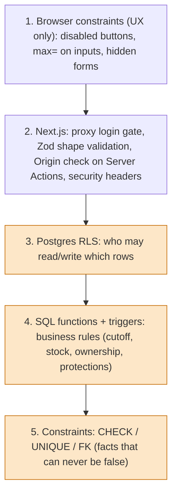

# 05 · Security and privacy

This document explains **how the app defends itself and the people using it**, why each layer exists, and what is *not* yet covered. It is not a substitute for a professional security review or the legal review ([`../legal-review-brief.md`](../legal-review-brief.md)).

## 1. Who and what are we protecting?

| Asset | Why it matters |
| --- | --- |
| **Customers' orders and notes** | Notes may mention allergies (health-adjacent data) |
| **Merchants' business data and customer lists** | A merchant must never see another merchant's customers |
| **Pickup locations and live location** | Merchants may be home kitchens: an address is a home address; live location is physical safety |
| **Photos** | Phone photos carry GPS metadata |
| **Accounts / sessions** | Account takeover = ordering/cancelling as someone else, or impersonating a merchant |
| **Secrets** (service-role key, API keys) | Leaking the service-role key = full database access |
| **Availability** | A sleeping/paused service loses orders on pickup day |

Who might attack or cause harm: curious/malicious signed-in users (a customer trying to read others' orders; a merchant trying to delete others' orders); anonymous internet users; bots; a careless contributor (committing a secret); and honest bugs. **Design assumption: the browser is untrusted. Anyone can open DevTools, read our anon key and call the API directly.**

## 2. Defence in depth (layers)

Layers 1–2 improve usability and block casual abuse; **layers 3–5 are the real security**. If you skip a lower layer "because the UI already prevents it", you have a bug that curl will find.

## 3. Threats and mitigations

| Threat | Mitigation | Where |
| --- | --- | --- |
| Customer reads other customers' orders | RLS: `customer_id = auth.uid()`; remaining stock via `offering_stock()` instead of aggregating others' rows | init migration |
| Merchant reads/changes another merchant's data | RLS with `is_merchant_owner()`; editing triggers; `confirm_pickup` checks token ↔ merchant | migrations, `tests/db` |
| Order after cutoff / oversell | `place_order`/`update_order` check cutoff and the stock *pool* inside one transaction with locks | SQL functions |
| Owner deletes other customers' orders via cascade | `protect_offering_delete` trigger; account deletion orders deletes explicitly | migration 20261006 |
| Merchant moves a pickup point under customers' feet | `protect_pickup_point_location` blocks changes while upcoming active orders exist | migration 20261016 |
| Anonymous visitor scrapes data | Everything except a tiny allow-list requires login (`lib/public-paths.ts`); anon role has no table rights | proxy + RLS |
| Public share page leaks too much | One whitelisting SQL function (`get_shared_offering`): no coordinates, customers, orders, stock, instructions; opt-in per offering; address hidden unless the merchant allows | migration 20261020 |
| Link/QR guessing | QR token = two random UUIDs (244 bits); offering/order numbers are *not* secrets and are never used as authorization | schema |
| Open redirect after login | `safeNext()` allows only same-site relative paths | `lib/auth.ts` |
| CSRF on forms | Server Actions are Origin-checked by Next; state changes are POST | Next.js |
| Clickjacking, MIME sniffing | `X-Frame-Options: DENY`, `frame-ancestors 'none'`, `nosniff`, restricted `Permissions-Policy`, HSTS (prod) | `lib/security-headers.ts` |
| XSS | React escapes output; email templates escape every dynamic value; no `dangerouslySetInnerHTML` of user text | code review, `lib/notifications/templates.ts` |
| Location leaks in photos | Browser re-encodes; server strips EXIF/XMP/IPTC; test injects fake GPS and proves removal | `lib/images.ts`, `tests/` |
| Stale live location (merchant closes the tab) | Customers only see positions < 2 min old; browser stops on page leave; auto-off after 4 h; daily wipe of coordinates > 12 h | migration 20261017, `components/location-toggle.tsx` |
| Secrets leaked to the browser | Only `NEXT_PUBLIC_*` reach the client; service-role key only in `lib/supabase/admin.ts` (server) | review rule |
| Secrets leaked to git | GitHub push protection enabled; tests build key-shaped strings at runtime | repo setting, [`../decisions.md`](../decisions.md) |
| Provider/API key abuse (place search) | Merchants only; per-user limit 20/min; 15-min cache; key server-side | `lib/places/search.ts` |
| Email abuse / unsubscribe forgery | HMAC-signed unsubscribe links (`UNSUBSCRIBE_SECRET`); one-click POST; per-user daily send cap | `lib/notifications/*` |
| Cron endpoints abused | Bearer `CRON_SECRET`, checked on the server | `app/api/cron/*` |
| Data loss | Daily **encrypted** `pg_dump` artifact (30 days); restore runbook | `.github/workflows/backup.yml` |
| Error reports leak personal data | Sentry configured to drop user/IP/cookies/headers/bodies/queries/vars; scrubber removes emails, JWTs, long tokens; tested against a fake receiver | `lib/sentry-*.ts` |

## 4. Secrets inventory

| Secret / value | Lives in | Exposure if leaked | Notes |
| --- | --- | --- | --- |
| `NEXT_PUBLIC_SUPABASE_URL`, `NEXT_PUBLIC_SUPABASE_ANON_KEY` | Render env (baked into the browser bundle) | **Public by design**: safe only because RLS protects data | Rotate if you change project |
| `SUPABASE_SERVICE_ROLE_KEY` | Render env, GitHub secret for the stack | **Catastrophic**: bypasses all security | Server-only; never `NEXT_PUBLIC_` |
| `CRON_SECRET` | Render env + GitHub secret | Anyone can trigger cron/notification runs | `openssl rand -hex 32` |
| `UNSUBSCRIBE_SECRET` | Render env | Forge unsubscribe links | Changing invalidates old links |
| `EMAIL_API_KEY` (Resend) | Render env | Send email as us | Provider dashboard can revoke |
| `GEOAPIFY_API_KEY` | Render env | Burn our free quota | Server-only |
| `SUPABASE_DB_URL` (session pooler string with password) | GitHub secret | Direct DB access | Used only for migrations/backups |
| `BACKUP_PASSPHRASE` | GitHub secret **and** the operator's password manager | Decrypt backups | **Losing it = backups unreadable**; keep a copy offline |
| `RENDER_DEPLOY_HOOK_URL` | GitHub secret | Anyone can trigger deploys of the current commit | Treat as secret |
| OAuth client secrets (Google/Facebook/Apple) | Supabase dashboard (hosted), `supabase/.env` (local) | Impersonate our app to the provider | Apple secret expires ≤ 6 months |
| `NEXT_PUBLIC_SENTRY_DSN` | Render env | Others can *send* events | Not a secret; low impact |

Rules: `.env*` is git-ignored (`.env.example` is committed with blanks); GitHub push protection is on and its "allow secret" bypass must not be used; **the repo is public**, so anything committed is world-readable.

## 5. Public versus private surface

Anonymous visitors can reach only (see `lib/public-paths.ts`, tested in `lib/__tests__/public-paths.test.ts`):

| Path | Why public |
| --- | --- |
| `/login`, `/auth/*` | sign-in flow |
| `/privacy`, `/terms` | login providers and app stores require reachable policy URLs |
| `/api/health` | uptime monitor |
| `/unsubscribe`, `/api/unsubscribe` | linked from emails, protected by a signed token; only POST changes anything |
| `/o/<offering number>` | the opt-in public page of a shared offering |

Everything else redirects to `/login`. Other "public-ish" things: food photo and logo URLs (public bucket, no personal data), and `/api/cron/*` (protected by its own secret, not by login).

## 6. Privacy by design: the choices

| Principle | Concrete choice |
| --- | --- |
| **Collect little** | No passwords, no phone numbers, no payment data, no analytics/ad trackers; email never required |
| **Show little** | Merchants see customer **name and picture**, not email; customers' precise location is never collected |
| **Opt-in for exposure** | Live location off by default and pickup-day only; public share page off by default; street address hidden by default |
| **Expire data** | Live position older than 2 minutes is invisible; coordinates wiped after 12 h; sessions expire |
| **Strip metadata** | Photo EXIF/GPS removed |
| **Delete on request** | In-app account deletion (also an app-store requirement) removes profile, orders, merchant data and files |
| **Encrypt backups** | Public repo → artifact must be encrypted |
| **Minimise third parties** | Each processor listed in `/privacy`: Supabase, Render, GitHub, Resend, Geoapify, Sentry, sign-in providers |
| **Be transparent** | Privacy policy and terms in 4 languages, structured so a test checks they cover what the app does |

The legal texts are **AI-drafted and not lawyer-reviewed** (open item in `docs/todo.md`); treat them as engineering documentation of behaviour until reviewed.

## 7. Known gaps (be honest in reviews)

| Gap | Risk | Tracking |
| --- | --- | --- |
| No shared rate limiter on server actions / auth routes | Abuse/DoS by a signed-in user; place-search limiter is per-process memory | roadmap SEC-2 |
| CSP has no `script-src` | XSS mitigation relies on React escaping | roadmap SEC-3 (nonce-based CSP) |
| Backups were never test-restored on hosted | They may not restore | todo: OPS-1 rehearsal |
| Terms acceptance is implicit | Weak evidence of agreement | roadmap SEC-9 |
| Free-tier Render sleeps; free Supabase pauses without traffic | Availability | uptime monitor + daily job; upgrade triggers in [06](06-hosting-deployment-ci.md) |
| No audit log of merchant actions | Hard to investigate disputes | idea |
| No WAF/bot protection in front of Render | Scraping, brute force on public pages | idea |

## 8. Security review checklist for a pull request

- [ ] New table → RLS enabled? Policies tested for customer, merchant, other merchant, anonymous (`tests/db`)?
- [ ] New SQL function → `security definer` only if needed; `set search_path = public`; `revoke … from public, anon` + explicit grants?
- [ ] New route handler → authenticated? secret-protected? validates input? uses `publicOrigin()` for redirects?
- [ ] New public page → what exactly can an anonymous user learn? Is it opt-in? Is the data whitelisted in SQL?
- [ ] New third-party call → what personal data leaves? Is it in the privacy policy? What happens when it fails? Key server-side?
- [ ] Anything storing files → path policy, size/type limits, metadata stripped, deleted with the account?
- [ ] Logging/Sentry → no emails, tokens or notes in messages?
- [ ] New env var → in `.env.example`, `render.yaml`, docs; `NEXT_PUBLIC_` only if truly public?
- [ ] Does a destructive `ON DELETE CASCADE` let someone delete *other people's* data?

## 9. Exercises

1. As a signed-in customer with DevTools open, try `supabase.from('orders').select('*')` using the page's client. What do you get? Why?
2. Find where the QR token is generated (default on `orders.qr_token`) and why `gen_random_uuid()` is used instead of `pgcrypto`.
3. Read `get_shared_offering` and list every key in its JSON output. Which key would you reject in review, and why? (Hint: none should reveal coordinates or customers.)
4. Try to think of a way a merchant could see another merchant's customer through `profiles`. Then read the `profiles_merchant_sees_customers` policy.
