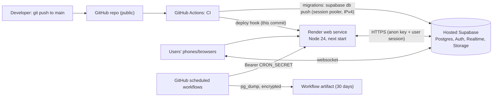
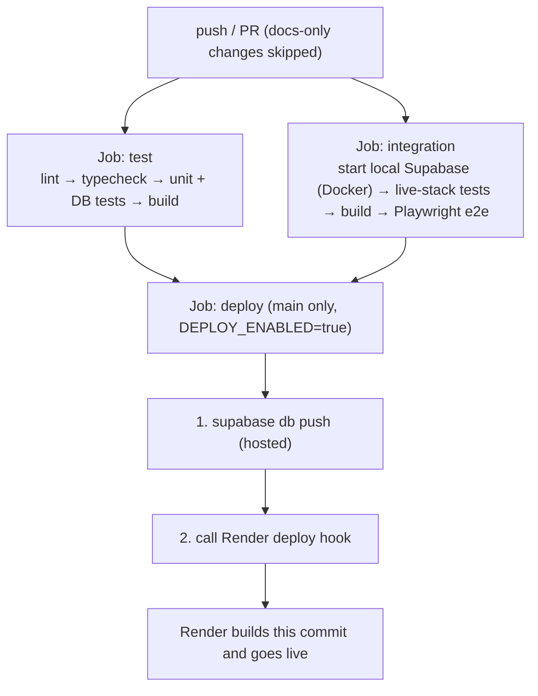

# 06 · Hosting, deployment and CI/CD

How the code gets from a developer's laptop to production, what runs where, why Render, and what it costs. Step-by-step *setup* instructions are in [`../deployment.md`](../deployment.md); this document explains the **why** and the **trade-offs**.

## 1. The runtime picture

Two hosts matter: **Render** runs our Next.js server; **Supabase** runs the data/auth/realtime/files. **GitHub Actions** is the pipeline *and* our cron scheduler.

## 2. Why Render

**What Render gives us:** a managed place to run a normal Node server from a Git repo, with free TLS certificates, a public URL, environment variables and logs. Our `render.yaml` ("Blueprint") describes the service: Node 24, `npm ci && npm run build`, `npm start`, health check, free plan, **auto-deploy off** (GitHub Actions triggers the deploy hook after tests pass).

**Why we chose it over alternatives (as of the October 2026 evaluation; verify before relying):**

| Option | Strengths | Weaknesses for *us* | Verdict |
| --- | --- | --- | --- |
| **Render (free web service)** | No credit card, allows commercial use, plain Node server (everything in Next.js works), simple deploy hook | **Sleeps after ~15 min idle** (30–60 s cold start); free instance-hour budget; outbound **SMTP is blocked** on free (so email uses an HTTPS API); not recommended by Render for production | ✅ chosen for the pilot |
| **Vercel** | Best Next.js experience, preview deployments, global CDN | Hobby plan is **non-commercial**; Pro is per-seat; server features priced by usage | ❌ for a business; ✅ for hobby |
| **Netlify** | Easy, generous static hosting | Next.js server features via adapter; credit-based limits | possible, not evaluated deeply |
| **Fly.io / Railway** | Containers close to users, always-on options, cheap | Usually need a card; more ops knowledge (Dockerfile/volumes) | good upgrade path |
| **Google Cloud Run** | Scales to zero, generous free tier | Billing account + Dockerfile; more moving parts | possible |
| **Cloudflare Workers (OpenNext)** | Very fast edge, big free tier | Newest/least proven path for Next 16; worker size limits | watch, not yet |
| **AWS (Amplify, App Runner, ECS, Lightsail)** | Enterprise features, scale | Complexity and bill surprises for a pilot | later, if ever |
| **VPS + Docker / Coolify / Dokku** | Full control, flat price | You patch, secure and monitor the server | only with ops capacity |

**Cons you will feel with Render free:** cold starts (mitigated by the uptime monitor pinging `/api/health` every ≤ 5 min), occasional restarts, limited build resources, no zero-downtime guarantees. **Upgrade path:** Render's paid instance (no sleep) is the first upgrade; the app is a standard Node container, so moving to Fly/Railway/Cloud Run is mostly configuration.

### Build-time versus runtime environment variables (important!)

`NEXT_PUBLIC_*` values (Supabase URL, anon key, auth providers, contact email, Sentry DSN) are **inlined into the browser bundle at build time**. Changing one in Render requires a **new deploy**, not just a restart. Secrets without the prefix (service-role key, API keys) are read at **runtime** on the server. Variables that must be literal `process.env.NEXT_PUBLIC_X` expressions (no dynamic lookup) or bundling will miss them.

## 3. Why Supabase hosted (and its free-tier shape)

| Aspect | Free plan reality (verify before relying) | What we do about it |
| --- | --- | --- |
| Pausing | Project pauses after ~7 days without requests | Daily job + uptime monitor touch the database |
| Backups | None automatic | Our own daily encrypted dump ([§6](#6-scheduled-jobs-and-backups)) |
| Size/limits | Small DB (~500 MB), limited Realtime connections (~200), 50k monthly active users | Fine for a pilot; upgrade triggers below |
| Direct DB host | IPv6-only | CI uses the **session pooler** connection string |
| Cost to upgrade | Pro ~$25/month (backups, no pause) | See triggers |

## 4. CI/CD: what happens on every push

Key facts:
- **Concurrency:** a newer push **cancels** an older in-progress run of the same ref (`concurrency: ci-<ref>`, `cancel-in-progress`). A "cancelled" run is not a failure; look at the newest run.
- **Deploy is gated** by both test jobs and by a repository variable `DEPLOY_ENABLED=true`. PRs never deploy.
- **Order matters:** migrations are applied **before** Render deploys. Database changes must therefore be **backward compatible** with the code currently running (the old website may serve requests while the new schema exists). That is why new SQL parameters have defaults and columns are added before they are required.
- **Docs-only commits** (`docs/**`, `*.md`) skip CI entirely.
- **Dependabot** opens weekly grouped PRs for npm and GitHub Actions (majors excluded for npm).
- **Pinned tooling:** Supabase CLI version is pinned (`2.119.0`) because `latest` hit GitHub API rate limits and drifted.
- **Playwright traces** are uploaded when e2e fails.

### Workflows

| File | Trigger | Purpose |
| --- | --- | --- |
| `ci.yml` | push/PR | test, integration + e2e, deploy |
| `scheduled.yml` | daily 06:17 UTC | `GET /api/cron/fetch-context` (weather/holiday snapshot **and** stale-location wipe; also keeps Supabase and Render awake) |
| `notifications.yml` | every 10 min | `POST /api/cron/send-notifications`: queue due emails and send the outbox; guarded by `NOTIFICATIONS_ENABLED` |
| `backup.yml` | daily 07:37 UTC | `supabase db dump` of schemas `public` + `auth` (no session tables) → **AES-256 encrypted** → artifact kept 30 days |

Why GitHub Actions as the scheduler instead of Supabase `pg_cron` or Render cron jobs? It is free, needs no extra infrastructure, keeps secrets in one place, and the jobs just call authenticated HTTP endpoints on our app (easy to test locally). Trade-offs: GitHub may delay scheduled runs by minutes; if the repo is made private, free minutes are capped. `pg_cron` + `pg_net` is a later optimisation ([`../plans/notif-1-email-notifications.md`](../plans/notif-1-email-notifications.md)).

## 5. Environments

| Environment | Where | Data | Purpose |
| --- | --- | --- | --- |
| **Local dev** | your machine: `supabase start` (Docker) + `npm run dev` | seed data (`supabase/seed.sql`) | daily work |
| **CI** | GitHub runner | throwaway local Supabase | automated tests |
| **Production** | Render + hosted Supabase | real data | users |
| *(Staging)* | not yet | — | roadmap OPS-6 (second Supabase project + Render service) |

There is **no staging**: production is where migrations first meet real data. Mitigation: migrations are tested against PGlite *and* a live local Supabase, with backfill tests that run a migration over "old" data (`createDb({ stopBefore })`). A deploy approval gate (OPS-7) is also on the roadmap.

## 6. Scheduled jobs and backups

- **Daily context job** also calls `clear_stale_locations()` so a merchant's old coordinates are erased even if they forgot to stop sharing.
- **Notifier** runs `enqueue_due_notifications()` then sends pending outbox rows (reminders ~3 h before pickup; merchant order summary after cutoff). Order confirmations are also attempted immediately after the order using Next's `after()`.
- **Backups:** because the repo is **public**, artifacts are downloadable by anyone; the dump is therefore always encrypted before upload and session/token tables are excluded. The `BACKUP_PASSPHRASE` must also live in the operator's password manager. **A restore has not been rehearsed on a hosted project yet** (see [`../backup-restore.md`](../backup-restore.md) and `docs/todo.md`): until then, backups are unproven.

## 7. Environment variable matrix

| Variable | Public? | Needed for | Where set |
| --- | --- | --- | --- |
| `NEXT_PUBLIC_SUPABASE_URL`, `NEXT_PUBLIC_SUPABASE_ANON_KEY` | yes (build-time) | everything | Render (+ `.env.local`) |
| `SUPABASE_SERVICE_ROLE_KEY` | **secret** | cron, email sending, account deletion | Render |
| `CRON_SECRET` | secret | cron endpoints | Render + GitHub secret |
| `NEXT_PUBLIC_AUTH_PROVIDERS` | yes (build) | login buttons | `render.yaml` |
| `NEXT_PUBLIC_SITE_URL` | yes (build) | canonical URL in emails/OG tags (optional) | Render |
| `NEXT_PUBLIC_OPERATOR_NAME`, `NEXT_PUBLIC_CONTACT_EMAIL` | yes (build) | privacy/terms identity | Render |
| `NOTIFICATIONS_PROVIDER`, `EMAIL_API_KEY`, `EMAIL_FROM`, `EMAIL_REPLY_TO`, `UNSUBSCRIBE_SECRET` | key/secret are secret | email | Render |
| `GEOAPIFY_API_KEY` | secret | merchant place search | Render |
| `NEXT_PUBLIC_SENTRY_DSN` (+ optional `SENTRY_AUTH_TOKEN/ORG/PROJECT` at build) | DSN public | error reporting | Render |
| GitHub secrets: `SUPABASE_DB_URL`, `RENDER_DEPLOY_HOOK_URL`, `CRON_SECRET`, `BACKUP_PASSPHRASE` · variables: `SITE_URL`, `DEPLOY_ENABLED`, `NOTIFICATIONS_ENABLED` | secrets | CI/CD, jobs | GitHub |

Full documented list: `.env.example`, `render.yaml`.

## 8. Cost and upgrade triggers

| Component | Today | Trigger to pay | Then |
| --- | --- | --- | --- |
| Render web | $0 | Real customers depend on it; cold starts hurt | paid instance (~$7/mo, verify) |
| Supabase | $0 | Data you cannot lose / project paused / > ~200 live-map users / DB > ~400 MB | Pro $25/mo |
| Resend | $0 (100 emails/day) | > 100 emails/day | paid tier |
| Geoapify | $0 (3,000 searches/day) | quota reached | paid tier or another provider |
| Sentry | $0 (5,000 errors/month) | noisy errors | fix the noise or upgrade |
| Domain | ~$10–15/yr | custom domain | roadmap OPS-8 |
| Apple Developer / Google Play | — | native apps | $99/yr, $25 once |

## 9. Common failure modes

| Symptom | Likely cause | Where to look |
| --- | --- | --- |
| Site slow once, then fine | Render cold start | uptime monitor frequency |
| `/api/health` 503 | Supabase paused or unreachable | Supabase dashboard; daily job status |
| Deploy job failed at "Apply database migrations" | pooler string wrong/password encoding, or a bad migration | run `supabase db push` locally with `--dry-run`; fix and add a new migration |
| Login redirects to `localhost` | Supabase Site URL/Redirect URLs not set | [`../social-login-setup.md`](../social-login-setup.md) |
| New env var not visible in the browser | `NEXT_PUBLIC_*` needs a rebuild | trigger a deploy |
| No emails | `NOTIFICATIONS_PROVIDER` off, key/domain not verified, `NOTIFICATIONS_ENABLED` unset | [`../plans/notif-1-email-notifications.md`](../plans/notif-1-email-notifications.md) |
| Facebook preview empty | Render asleep when the crawler arrived | re-scrape in the Sharing Debugger; keep the monitor pinging |

## 10. Exercises

1. Read `.github/workflows/ci.yml` and draw which jobs run in parallel and what `needs:` forces.
2. Why must the deploy job run `db push` **before** triggering Render, and what property must every migration have because of that order?
3. Suppose you rename a column. Describe a two-step (two-deploy) migration that never breaks the running site.
4. What would you change to add a staging environment? (Hint: second Supabase project, second Render service, a `staging` branch, a separate set of secrets.)
