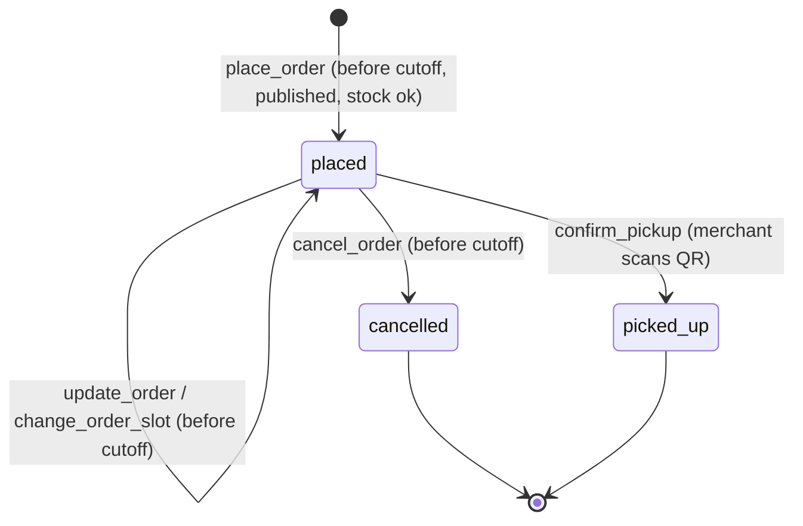
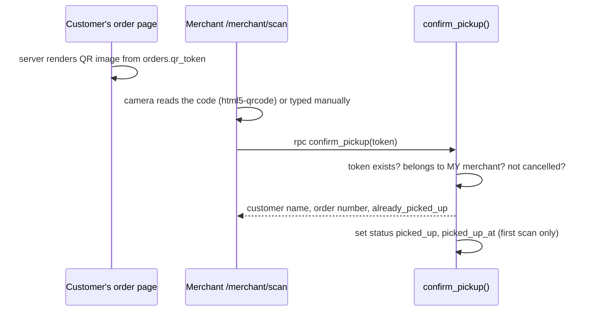
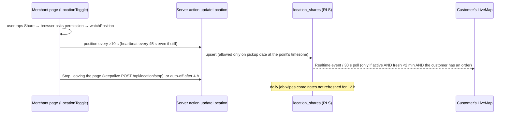
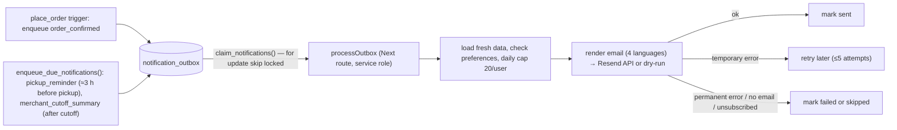

# 07 · Core flows (how the important features really work)

Each flow lists **what happens, which files and database objects are involved, the rules it relies on, and the edge cases that bit us.** Use it together with [`../features.md`](../features.md) (the file-by-file map) and [`../data-model.md`](../data-model.md).

## Contents
1. [Offerings, slots and groups](#1-offerings-slots-and-groups)
2. [Ordering, editing, cancelling (cutoff and stock)](#2-ordering-editing-cancelling)
3. [Order numbers and price snapshots](#3-order-numbers-and-price-snapshots)
4. [Edit protections](#4-edit-protections)
5. [QR pickup](#5-qr-pickup)
6. [Live location](#6-live-location)
7. [Email notifications (the outbox)](#7-email-notifications-the-outbox)
8. [Public sharing page](#8-public-sharing-page)
9. [Pickup points: search, map and time zones](#9-pickup-points-search-map-and-time-zones)
10. [Account deletion](#10-account-deletion)
11. [Reports and weather/holiday context](#11-reports-and-weatherholiday-context)
12. [Photos and logos](#12-photos-and-logos)

---

## 1. Offerings, slots and groups

A merchant creates an **offering**: foods (each with optional price and quantity limit), a pickup **date**, a **cutoff**, optional instructions, and one or more pickup **slots** (pickup point + from/until time).

- Rules (decided with the product owner): all slots share **one date, one cutoff, one food list/limit/price set**; **one slot per order**; the same pickup point may appear twice with different times (the merchant gets a warning in the review step); stock is **shared across slots**.
- Implementation trick: **a slot is an `offerings` row**; slots of one offering share `group_id` and `offering_no`. Everything per slot (orders, QR, reminders, live location, reports) therefore needed no change.
- `add_offering_slot` copies foods/limits/prices/cutoff into a sibling; `update_offering` keeps the shared parts in sync across *upcoming* siblings; `duplicate_offering` makes a *new* offering (new number) on another date.
- Customers see one card per merchant on Browse, then the merchant's offerings; multi-slot offerings show places grouped with colour-coded time buttons (`components/pickup-slot-list.tsx`, `lib/slots.ts`).
- The merchant sees **one row** per offering (Dashboard = working view of non-closed upcoming offerings; History = everything with status filters), and the detail page aggregates orders across all slots.

Files: `components/offering-form.tsx`, `extra-slots.tsx`, `offering-review.tsx` (the review step before publishing), `app/merchant/offerings/**`, migrations `…11`, `…12`, `…14`, `…19`.

## 2. Ordering, editing, cancelling

Rules enforced **in SQL** (`place_order`, `update_order`, `cancel_order`, `_write_order_items`):

1. The offering must be **published** and `now() < cutoff_at`.
2. One **active** order per customer per offering (partial unique index `where status <> 'cancelled'`; a cancelled order does not block re-ordering).
3. **Stock:** for each limited item, `used + requested <= limit`, where `used` counts all non-cancelled orders in the **pool** (same food across the offering's slots), excluding the order being edited. Concurrency is handled by transaction locks, so the last item cannot be sold twice.
4. Only the customer can change their order; once `picked_up` or `cancelled` it is frozen.
5. A customer may **move** a placed order to another slot of the same offering before cutoff (`change_order_slot`); quantities, price snapshot and order number are kept; stock cannot run out because it is pooled.

App side: `app/orders/actions.ts` validates shape (at least one item, note ≤ 300), calls the RPC, and **translates English database errors** into the user's language (`lib/db-errors.ts`). After `place_order` it asks the notifier to send the confirmation straight away with `after()` (best effort; the 10-minute job is the safety net).

UI hints (`components/order-form.tsx`): "N left" shows true remaining stock; `max` on the quantity input is remaining + the customer's own quantity (so they can keep what they have); a running total appears while typing.

Edge cases remembered: cutoff is stored as an absolute instant but **validated and displayed in the pickup point's timezone**; "Duplicate to a new date" keeps the **wall-clock lead** so DST does not shift the cutoff; cutoff shown to viewers in **their** timezone (`components/local-instant.tsx`).

## 3. Order numbers and price snapshots

**Human-friendly IDs** (separate from UUID keys):

| Level | Format | Counter | Assigned by |
| --- | --- | --- | --- |
| Merchant | `m00001` | global sequence | default on `merchants.code` |
| Offering | `m00001-000001` | per merchant | trigger `assign_offering_number` (slots of a group copy the sibling's number) |
| Order | `m00001-000001-000001` | per offering | trigger `assign_order_number` |

Counters live in tables nobody but the trigger can touch; the trigger's `insert … on conflict do update` **locks the counter row**, so concurrent orders get distinct numbers (proved by a live-Postgres test with six simultaneous orders). Numbers are permanent: cancelled orders keep theirs; client-supplied values are ignored; edits are refused.

**Prices:** `offering_items.price_cents` (optional, whole US cents, per offering item, never on the food). Each `order_items` row stores `unit_price_cents` when first ordered, so a later price change does not alter existing orders; an edited order keeps each line's original price and only a *new* food gets the current one. Totals are computed in `lib/money.ts` (quantity × unit price; "partial" if some lines have no price) and shown on the order page, My orders, emails and merchant lists. Nothing is charged: payment is arranged directly (cash/Venmo/Zelle).

## 4. Edit protections

Triggers keep customers safe from merchant edits (all in migrations `…06`, `…16`):

- cannot **move** an offering (point/date) while it has active orders; cannot edit the schedule of a **past** offering;
- cannot **delete** an offering with placed/picked-up orders (this closes the cascade hole);
- cannot **remove** a food with active orders, nor lower a **limit** below what was ordered across the pool;
- cannot change a pickup point's **address/map position** while an upcoming offering at it has active orders (name and timezone stay editable).

## 5. QR pickup

The token is 244 random bits. The function is **idempotent**: a second scan returns "already picked up" instead of an error. Merchants see the order number and customer name in the scan result.

## 6. Live location

Goal: customers can see the merchant approaching on pickup day, **without** leaving location data lying around.

Privacy rules are SQL policies (see [05](05-security-and-privacy.md)): write only on the pickup date; read only if `active`, updated in the last 2 minutes, and the reader has a non-cancelled order. The red "You are sharing your live location" banner makes sharing visible. Real-device behaviour (screen lock, background tabs) is on the QA checklist: a web page cannot track in the background; a native app could.

## 7. Email notifications (the outbox)

Why an **outbox table** instead of sending inline? Sending email can fail or be slow; orders must not. The order is saved first; "send an email" becomes a row that a worker retries.

- Triggered by: right after an order (`after()`), and **every 10 minutes** by `notifications.yml` calling `POST /api/cron/send-notifications` (Bearer `CRON_SECRET`).
- Content is **rebuilt at send time** from live data (an order cancelled meanwhile is skipped).
- Each email links to the order and has a **signed one-click unsubscribe** (`UNSUBSCRIBE_SECRET`, HMAC); the Account page has a toggle (`profiles.email_notifications`).
- Provider is switched by `NOTIFICATIONS_PROVIDER` (`off` | `dry-run` | `resend`); tests use fakes. Details of Resend: [08](08-integrations.md).
- Idempotent: rows are unique per (user, type, entity) so nothing is sent twice.

## 8. Public sharing page

Problem: a plain link previews as "Sign in" because link-preview robots cannot log in.

Solution: `/o/<offering number>?lang=…` is a **public, server-rendered** page with Open Graph tags (`generateMetadata`), fed by one **whitelisting SQL function** `get_shared_offering` that returns null unless the merchant opted in. The merchant's "Share this offering" section offers the link, a ready-made post in 4 languages (`lib/share-text.ts`), Copy buttons, the phone share sheet and a Facebook share button. The street address is shown only if the merchant allows it. "Order now" sends visitors through login to the normal order page.

## 9. Pickup points: search, map and time zones

- Merchants search a business/ZIP (**Geoapify**, called from our server with a key, cached 15 min, limited 20/min/user) or click the map; latitude/longitude/timezone are filled in and tucked under "Technical details".
- Timezone: from the search result, else computed offline from the position (`tz-lookup`). *History:* the first version defaulted it on the server (UTC) and every point got UTC: always derive it from the point, never from the server.
- Editing is allowed, but address/position cannot change while upcoming orders exist (trigger).

## 10. Account deletion

Required by app stores and privacy law. Server action `deleteAccount`: confirm by typing `DELETE` → refuse if the user is a merchant with upcoming active orders (`account_deletion_blocker()`) → delete the merchant's storage folder → `auth.admin.deleteUser` → **database cascades** remove profile, orders, merchant data. A before-delete trigger orders the cascade (orders → offerings → foods) to satisfy foreign keys.

## 11. Reports and weather/holiday context

`order_lines` is a **security-invoker view** (merchant-scoped by RLS) feeding `/merchant/reports?by=date|location|holiday|weather`, aggregated by pure functions in `lib/reports.ts`. A daily job (`/api/cron/fetch-context`) stores weather (Open-Meteo) and public-holiday (Nager.Date) snapshots per offering in `offering_context` using the service-role client; it also wipes stale live locations.

## 12. Photos and logos

Browser resizes to a ≤1200 px JPEG (drops metadata, applies phone rotation) → server re-validates (JPEG signature, size) and **strips every metadata segment** → uploads with the merchant's own session to `food-images/<merchant_id>/…` (storage policy checks the folder). Replacing/removing deletes the old file; account deletion deletes the folder. Merchant logos share the bucket and pipeline.

## Cross-cutting invariants (a checklist for reviews)

1. No order can exist for an unpublished offering, after cutoff, beyond stock, or twice (active) for the same customer+offering.
2. Money is integer cents; an order's price never changes after the fact.
3. Numbers are unique, permanent and never used for authorization.
4. Anonymous users can only learn what `get_shared_offering` returns.
5. A merchant can never read or modify another merchant's rows, nor delete other people's orders.
6. Live location is invisible unless active, fresh, on pickup day and the viewer has an order.
