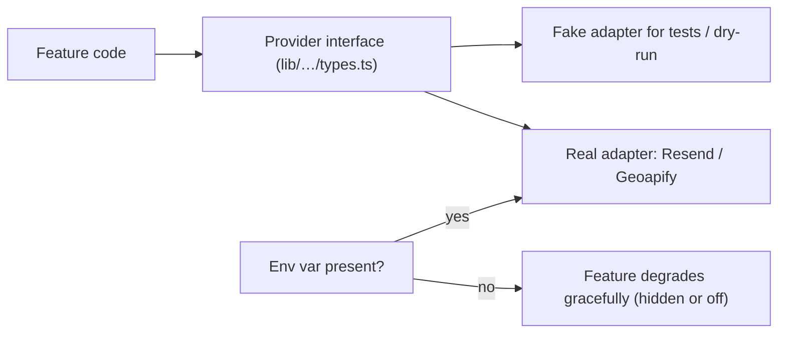

# 08 · Third-party integrations

Every external service the app touches, in one place: **why, what data leaves, what happens when it fails, what it costs, and what we could use instead.** (Supabase, Render, GitHub and the OAuth providers have their own sections: [03](03-database-supabase.md), [06](06-hosting-deployment-ci.md), [04](04-authentication-oauth.md).)

## The integration pattern we follow

Optional services are **adapters switched by environment variables**:

| Rule | Why |
| --- | --- |
| **Graceful degradation**: no key → email "off", place-search box hidden, Sentry silent | The app must run (and be tested) without any account |
| **Key stays on the server** (`GEOAPIFY_API_KEY`, `EMAIL_API_KEY`) | Browsers must never see it |
| **Errors never leak secrets** (adapters redact the key from messages) | Logs/Sentry are read by more people than the key |
| **Fake provider in tests**, never the real service | No quota burned, deterministic (`tests/e2e/geoapify-stub.mjs`, fake `fetch` in unit tests) |
| **Timeouts** (e.g. 5 s for place search) and **caching/rate limiting** where it costs quota | A slow vendor must not freeze our page |
| **List the vendor in the privacy policy** when personal data reaches it | Legal transparency |

## 1. Resend (transactional email)

| | |
| --- | --- |
| **Used for** | Order confirmation, pickup reminder, merchant order summary |
| **Why it is needed** | We deliberately have **no passwords/magic links**, so email is purely informational; but users want confirmations/reminders |
| **How** | HTTPS API (`lib/notifications/provider.ts`), driven by an outbox table ([07 §7](07-core-flows.md#7-email-notifications-the-outbox)) |
| **Why an HTTP API, not SMTP** | Render's free tier **blocks outbound SMTP ports** |
| **Data sent** | Recipient email, name, order contents/prices, merchant name, pickup details |
| **Setup** | Verify a sending domain with SPF/DKIM DNS records; set `NOTIFICATIONS_PROVIDER=resend`, `EMAIL_API_KEY`, `EMAIL_FROM`, `UNSUBSCRIBE_SECRET`; set repo variable `NOTIFICATIONS_ENABLED=true` |
| **When it fails** | Row retried up to 5 times, then marked failed; ordering is unaffected |
| **Free tier** | ~100 emails/day (verify) |
| **Alternatives** | Postmark (excellent deliverability, paid), SendGrid, Mailgun, **Amazon SES** (cheapest at scale, more setup), Brevo; SMTP only on a host that allows it |

Design details worth knowing: per-user daily cap (20), HMAC-signed one-click unsubscribe (also `List-Unsubscribe` headers), every dynamic value HTML-escaped, content rebuilt at send time, emails never require a deliverable address (skipped when missing).

## 2. Geoapify (place search for pickup points)

| | |
| --- | --- |
| **Used for** | Merchant types "99 Ranch" + "95014" → list of matching places → fills name, address, position, timezone |
| **Why** | Coordinates mean nothing to merchants; business/ZIP search does |
| **How** | `app/api/places/search` (merchants only) → `lib/places/search.ts` (validation, 15-minute cache, 20 searches/min/user) → `lib/places/geoapify.ts` (`/v1/geocode/search`, country filter) |
| **Search on submit, not per keystroke** | One request = one credit; free plan is 3,000/day |
| **Data sent** | The text the merchant typed + country; no account data |
| **Terms** | Free plan permits commercial use and storing results; requires a visible "Powered by Geoapify" credit (we show it) |
| **When it fails/absent** | Search box hidden or shows "unavailable"; the merchant can still click the map or use their location |
| **Alternatives** | **Nominatim (public OSM)**: free but forbids autocomplete, 1 req/s, strict policy; **Photon**: free, typeahead, no guarantee; **Google Places**: best business coverage, needs billing; **Mapbox / LocationIQ / HERE**: paid/free tiers with keys |

## 3. Open-Meteo and Nager.Date (weather and public holidays)

| | |
| --- | --- |
| **Used for** | Reports "by weather" and "by holiday": a daily job stores a snapshot per offering (`offering_context`) |
| **How** | `lib/context-fetch.ts`, called by `/api/cron/fetch-context` (service role) |
| **Keys** | None |
| **Data sent** | Pickup point coordinates and date (weather); country code and date (holidays). No personal data |
| **When it fails** | Context is simply missing for that offering; reports degrade, nothing else |
| ⚠️ **Licence risk** | Open-Meteo's free API is for **non-commercial** use; a merchant platform may need their paid plan or another source (roadmap OPS-10) |
| **Alternatives** | Paid Open-Meteo, WeatherAPI, Visual Crossing, NOAA/NWS (US, free), Calendarific (holidays) |

## 4. OpenStreetMap tiles (map background)

Leaflet loads tile images from OSM's public tile servers; attribution "© OpenStreetMap contributors" is shown. The tile request reveals the viewer's IP to OSM (standard for any map). OSM's tile policy suits low traffic; at scale switch to a paid tile provider (MapTiler, Stadia, Mapbox) or self-host. Alternatives to Leaflet+OSM: Google Maps, Mapbox GL, MapLibre.

## 5. Sentry (error monitoring)

| | |
| --- | --- |
| **Used for** | Learning about unexpected server/browser errors with stack traces |
| **Privacy posture** | Sends **no** user id/email/IP, cookies, headers, request bodies, query strings or local variables; no tracing or session replay; remaining text scrubbed of emails, JWTs, API keys and long tokens. Verified by a test against a fake Sentry receiver |
| **How** | `@sentry/nextjs`, options in `lib/sentry-options.ts`, scrubber `lib/sentry-scrub.ts`, off unless `NEXT_PUBLIC_SENTRY_DSN` is set |
| **Free tier** | 5,000 errors/month, 30 days (verify) |
| **Alternatives** | GlitchTip (open source, Sentry-compatible, self-host), Rollbar, Bugsnag, Datadog, or just platform logs |

Setup/verification: [`../monitoring.md`](../monitoring.md) (`scripts/verify-sentry.sh`).

## 6. Uptime monitoring

`GET /api/health` runs a tiny real query against Supabase and returns 200/503 (so it detects a **paused Supabase project** too). An external monitor (Better Stack or UptimeRobot) pings every 3–5 minutes: it alerts us **and** keeps the free Render service awake. Note UptimeRobot's free plan is non-commercial. Details: [`../monitoring.md`](../monitoring.md).

## 7. Facebook / WhatsApp / social platforms (link previews)

Not an API integration: these services *fetch our public share page* and read Open Graph tags. Operational tip: use Facebook's **Sharing Debugger** to refresh a cached preview; a sleeping Render instance can make the first scrape fail.

## 8. What leaves the system, summarised

| Service | Personal data sent | Documented in privacy policy |
| --- | --- | --- |
| Sign-in providers | They tell us name/email/photo (inbound) | yes |
| Resend | recipient email/name, order contents | yes |
| Geoapify | merchant's search text | yes |
| Sentry | scrubbed error text only | yes |
| Open-Meteo / Nager.Date | none (coordinates/country/date) | n/a |
| OpenStreetMap tiles | viewer IP (as with any map) | n/a |
| Render, Supabase, GitHub | hosting/processing of all app data | yes |

## 9. Adding a new integration (checklist)

1. Define a small interface and an adapter; read the key from env; return `null`/off when absent.
2. Redact the key in errors; set a timeout; cache/rate-limit if it costs money.
3. Write unit tests with a fake `fetch`; add an e2e stub if the UI depends on it.
4. Decide what personal data leaves; update privacy policy (4 languages) and `docs/legal-review-brief.md`.
5. Add the env var to `.env.example`, `render.yaml` and the docs; note the quota and the upgrade trigger.
6. Decide the failure behaviour *before* writing code (hide, retry, or degrade).
