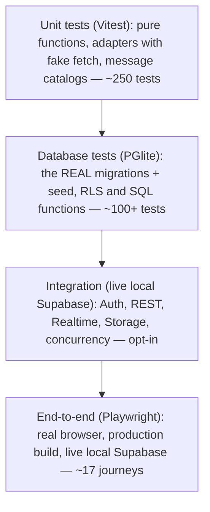

# 09 · Testing and quality

The app handles orders and personal data, and most of its rules live in SQL, so **tests are how we are allowed to change things confidently.** This document explains the four layers, what each can and cannot catch, and how to add tests.

## 1. The test pyramid (what we actually run)



(Counts are approximate and grow; run `npm test` for the current number.)

| Layer | Location | Command | Runs where | Speed |
| --- | --- | --- | --- | --- |
| **Unit** | `lib/__tests__/*.test.ts` | `npm test` | everywhere | seconds |
| **DB (PGlite)** | `tests/db/*.test.ts` | `npm test` (included) | everywhere | seconds |
| **Integration** | `tests/integration/*.test.ts` | `SUPABASE_INTEGRATION=1 npx vitest run tests/integration` (needs `supabase start`) | local, CI `integration` job | tens of seconds |
| **End-to-end** | `tests/e2e/*.spec.ts` | `npm run build && npm run test:e2e` (needs `supabase start`) | local, CI `integration` job | ~20–30 s |

Also run before finishing any change: `npm run typecheck && npm run lint && npm run build` (the project's rule in `CLAUDE.md`). **`next build` type-checks the tests too.**

## 2. Unit tests (`lib/__tests__`)

Pure logic with no network: formatting, money parsing, locale negotiation, cutoff helpers, share-text builder, report aggregation, public-path rules, Sentry scrubbing, notification templates (rendered in all four languages), the Geoapify adapter (with a fake `fetch`), the place-search cache/rate-limit, unsubscribe tokens, security headers.

Special guard: **`messages.test.ts`** fails if any language is missing a key, has an empty message, or its `{placeholders}`/`<tags>` differ from English. Avoid plural words differing across languages inside the same ICU message (the test tokenizes them).

Gotcha: Vitest has no `@/` alias configured here. Files in `lib/` that tests import must use **relative imports** (`./format`, not `@/lib/format`).

## 3. Database tests with PGlite (the most valuable layer)

**PGlite** is Postgres compiled to WebAssembly: a real database engine inside the test process. `tests/db/harness.ts`:

1. creates stand-ins for the Supabase parts our SQL needs (`auth.users`, `auth.uid()`, roles `anon`/`authenticated`/`service_role`, a `storage` schema, the `supabase_realtime` publication);
2. runs **every file in `supabase/migrations/` in order**, then `seed.sql`;
3. offers `asUser(db, userId, fn)` which switches to the `authenticated` role with a fake JWT subject so **RLS applies exactly as in production**, and `createDb({ stopBefore })` to build a database as it was *before* a given migration (to test backfills over "old" data).

What this proves: policies (customer/merchant/other merchant/anonymous), functions (`place_order` rules, stock pools, numbering, price snapshots), triggers (edit protections), constraints, and that migrations apply cleanly **in sequence**.

What it **cannot** prove: real Supabase Auth, PostgREST, Realtime, Storage service behaviour, extension availability on hosted, true multi-connection concurrency (PGlite has one connection; role switching between interleaved `Promise.all` calls would corrupt the test). Those belong to integration tests.

Pattern for a new rule:
```ts
it("refuses X for role Y", async () => {
  await expect(asUser(db, IDS.customer, () => db.query("select place_order(...)")))
    .rejects.toThrow(/expected message/);
});
```
Write the *refusal* cases, not just the happy path. Cover: owner, other merchant, customer, anonymous.

## 4. Integration tests (live local Supabase)

Start with `supabase start`; tests create users through the **admin API** (OAuth cannot be automated), sign them in with passwords, and go through PostgREST/RPC/Realtime like the app does. They cover: schema + RLS over HTTP, Realtime location updates, Storage upload rules, account-deletion cascades with the real auth service, notifications end to end (dry-run sender), and **concurrent order numbering** (six simultaneous orders get six distinct consecutive numbers).

They are skipped unless `SUPABASE_INTEGRATION=1`, so `npm test` stays fast and Docker-free.

## 5. End-to-end tests (Playwright)

`playwright.config.ts` starts **two production servers** from one build (`next start`): one with place search switched on and pointed at a **local stand-in for Geoapify** (`tests/e2e/geoapify-stub.mjs`), one with **no key** (to test the fallback). Users sign in without OAuth: `tests/e2e/helpers.ts` creates a password user with the admin API, signs in with `@supabase/ssr`, and **copies the resulting session cookies into the browser context**.

Journeys covered include: customer order/edit/language/cancel; merchant adds pickup point (map and search); publishes an offering through the form with stock limits; multi-slot offerings and moving an order; same pickup point at two times with warnings; Browse shows each merchant once; Dashboard/History filters; profile with logo/contact; multi-line food description; live location banner/auto-off/denied permission; public sharing page (anonymous context, OG tags, address hidden, off → 404); prices and totals; the place-search failure paths.

**Writing stable e2e tests (lessons learned):**
- Prefer roles/labels (`getByRole`, `getByLabel`) over CSS. Translations are inlined in page payloads, so searching raw text can match hidden data; assert on real elements.
- When an action saves asynchronously and a *previous* "Saved" message is still on screen, **poll the database** (`expect.poll(...)`) before the next step: UI messages can be stale.
- A `select` option is hidden: assert on visible elements.
- Time-dependent tests use dates relative to today (`ymd(3)`).
- Every test creates its own users/merchants (unique names with a random suffix) and the suite deletes users afterwards.

## 6. CI

See [06](06-hosting-deployment-ci.md): `test` job = lint → typecheck → unit+DB → build; `integration` job = start Supabase → live tests → build → Playwright; `deploy` needs both. Failed e2e uploads Playwright traces.

## 7. What is *not* automated (manual checks)

| Area | Why manual | Where tracked |
| --- | --- | --- |
| Real OAuth logins (Google/Facebook/Apple) | needs provider accounts/consent | `docs/social-login-setup.md` |
| Phone camera QR scan, GPS, screen lock, home-screen install, share sheet | needs real devices | [`../qa-real-device.md`](../qa-real-device.md) |
| Real email delivery and Facebook link previews | needs the live domain/accounts | `docs/todo.md` |
| Translation quality | needs native speakers | `docs/todo.md` (QA-3) |
| Backup **restore** | needs a spare Supabase project | `docs/todo.md` (OPS-1) |
| Accessibility/dark-mode pass | not done yet | roadmap QA-4 |

## 8. Which test do I add? (decision table)

| You changed… | Add/extend |
| --- | --- |
| A SQL rule, policy, trigger, function | a **`tests/db`** test (with refusal cases for each role) |
| A migration that rewrites existing data | a `tests/db` test using `createDb({ stopBefore })` with old data |
| Pure TypeScript logic | a **unit test** in `lib/__tests__` |
| An adapter to a third party | unit test with fake `fetch` (success, HTTP error, malformed body, secret not leaked) |
| Anything depending on real Auth/Storage/Realtime/concurrency | an **integration** test |
| A user-visible journey or a form | a Playwright **e2e** journey (and check the error case keeps typed values) |
| A new translated string | nothing extra: `messages.test.ts` enforces parity |

## 9. Quality gates and habits

- **No merge without green CI.** A "cancelled" run is not a pass; wait for the newest run.
- Fix flaky tests by understanding the race (poll the DB, await the visible state), not by adding sleeps.
- Do not weaken a test to make it pass; if a rule changed on purpose, change the test *and* say why in the commit.
- When a production bug is found, **write the failing test first**, then fix; record notable ones in [`../decisions.md`](../decisions.md).
- Lint rules (React hooks, no `any`) catch real bugs; do not disable them casually.

## 10. Exercises

1. Run `npm test`, then break the cutoff check in a *copy* of `place_order` and see which test fails.
2. Read `tests/db/pickup-slots.test.ts` and list the rules it documents.
3. Why is the "six simultaneous orders" test in `tests/integration` and not in `tests/db`?
4. Run the Playwright suite headed (`npx playwright test --headed -g "sharing"`) and watch the anonymous context.
