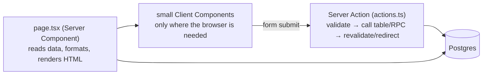

# 10 · Code structure and patterns

How the code is organised, the patterns we use over and over, and a recipe for adding a feature without fighting the codebase. Prerequisite: [01](01-system-overview.md) and [02](02-tech-stack-and-alternatives.md).

## 1. Route map (`app/`)

| Area | Routes | Notes |
| --- | --- | --- |
| Customer | `/` (Browse: one card per merchant), `/merchants/[id]` (their open offerings), `/offerings/[id]` (order form), `/orders`, `/orders/[id]` (QR, total, edit/cancel, move slot), `/account` | server components; forms call actions in `app/orders/actions.ts` |
| Merchant | `/merchant` (Dashboard), `/merchant/offerings` (History), `/merchant/offerings/new`, `/[id]`, `/[id]/edit`, `/merchant/foods`, `/pickup-points`, `/profile`, `/customers`, `/reports`, `/scan`, `/setup` | layout in `app/merchant/layout.tsx`; actions in `app/merchant/actions.ts` |
| Public | `/login`, `/privacy`, `/terms`, `/o/[offeringNo]`, `/unsubscribe` | listed in `lib/public-paths.ts` |
| Auth plumbing | `/auth/callback`, `/auth/signout` | route handlers |
| API / jobs | `/api/health`, `/api/places/search`, `/api/location/stop`, `/api/unsubscribe`, `/api/cron/{fetch-context,send-notifications,sentry-test}` | route handlers; cron ones need `CRON_SECRET` |

Cross-cutting: `app/layout.tsx` (header, language switcher, security of nav), `proxy.ts` (session + login gate), `i18n/request.ts` (locale per request), `app/manifest.ts` (PWA).

## 2. Library map (`lib/`)

| Module | Responsibility | Pure? |
| --- | --- | --- |
| `supabase/{client,server,admin,proxy}.ts` | the three Supabase clients + session refresh | no |
| `auth.ts` | `requireUser`, `requireMerchant`, `getMyMerchant`, `safeNext` | no |
| `locale.ts`, `format.ts`, `money.ts`, `slots.ts`, `cutoff.ts`, `timezone.ts`, `reports.ts` | locale negotiation + merchant translations, dates/times, money, slot grouping, cutoff checks, tz lookup, report aggregation | **yes** (unit-tested) |
| `db-errors.ts` | English DB error → translation key | yes |
| `images.ts` | image validation + metadata stripping + storage URL helpers | yes |
| `places/*`, `notifications/*` | provider adapters, outbox processor, templates, unsubscribe tokens | adapters take injected `fetch`/store so they are testable |
| `share-text.ts`, `shared-offering.ts` | public-share post/OG text and parsing | yes |
| `public-paths.ts`, `security-headers.ts`, `origin.ts`, `site.ts` | public route list, headers, proxy-safe URLs | yes |
| `sentry-*.ts`, `health.ts` | monitoring helpers | yes |
| `context-fetch.ts` | weather/holiday clients | network |

Rule of thumb: **put logic in a pure `lib/` function with a unit test; keep pages thin.**

## 3. Server Components, Client Components, Server Actions



Use a **Server Component** (default) for anything that just shows data. Add `"use client"` only for: state/effects (live map, location toggle, order form with a running total), browser APIs (camera, geolocation, clipboard, Web Share), or event handlers. Props passed from server to client must be serialisable (no functions).

Examples of the split: `app/merchant/offerings/[id]/page.tsx` (server) renders `components/share-section.tsx` (server) which renders `components/share-tools.tsx` (client: clipboard, share sheet). `components/live-map-loader.tsx` loads the Leaflet map with `dynamic(..., { ssr: false })` because Leaflet needs `window`.

## 4. Server Action conventions

```ts
"use server";
export type FormState = { error?: string; saved?: boolean } | undefined;

export async function addFood(_prev: FormState, formData: FormData): Promise<FormState> {
  const t = await getTranslations("foods");
  const parsed = z.object({ name: text.min(1, t("nameRequired")) }).safeParse(Object.fromEntries(formData));
  if (!parsed.success) return await firstError(parsed.error);           // translated error string
  const { supabase, merchant } = await requireMerchant();                 // auth + role
  const { error } = await supabase.from("food_items").insert({ ... });
  if (error) return { error: await dbError(error.message) };              // DB message → user's language
  revalidatePath("/merchant/foods");
  return undefined;                                                       // success (or { saved: true })
}
```

1. First argument is the previous state (React's `useActionState`).
2. Build the Zod schema **inside** the action so messages are translated.
3. Call `requireUser()`/`requireMerchant()` first; the server client carries the user's session.
4. Return `{ error }` for failures; `redirect()` on navigations; `revalidatePath()` after writes.
5. **Never** put business rules here; call the table/RPC and let SQL refuse.

### Forms must not wipe typed values on errors

React 19 resets a `<form action>` after any action finishes, even if it failed, which would delete everything the user typed. Use **`components/use-action-form.ts`** (through `ActionForm` or `OrderForm`): it submits via `onSubmit` + `startTransition` and resets only on success. Use `ActionForm` (`components/action-form.tsx`) for ordinary forms; it also provides the `Field` and `inputClass` helpers and optional `confirmMessage`.

## 5. Reading data safely

- Use embedded selects with generated types: `supabase.from("offerings").select("id, merchant:merchants(name), offering_items(price_cents, food_item:food_items(name))")`. If the generated types lack a relationship, add the FK/regenerate (`types/database.ts`).
- Customers cannot read other customers' orders: use the SQL helper (`offering_stock`) instead of aggregating client-side.
- Group "slots of one offering" with `groupOfferings` / `groupSlotsByPoint` (`lib/slots.ts`) rather than ad-hoc loops.
- For anonymous pages call the dedicated SQL function (`get_shared_offering`) through the **server** client; never `select` tables as anonymous.

## 6. Internationalisation in code

- Server: `const t = await getTranslations("ns")`; client: `useTranslations("ns")`; formatting locale: `getLocale()` / `useLocale()`.
- Keys are typed from `messages/en.json`; add the key to **all four** catalogs (`es`, `zh-CN`, `zh-TW`); `messages.test.ts` enforces parity.
- Merchant-written text: `localized(value, translations, locale, field)`; the original is the fallback.
- Public share page renders in `?lang=` using `createTranslator` with the right messages (no cookie available for crawlers).
- Details: [`../i18n.md`](../i18n.md).

## 7. Dates, times and time zones

| Need | Helper |
| --- | --- |
| Format a pickup date/time (no zone shift) | `formatDate`, `formatTime` |
| Show an absolute instant (cutoff) in a zone | `formatInstant(iso, locale, tz)`; on screen use `components/local-instant.tsx` to show the **viewer's** zone |
| "Is today the pickup day *at the pickup point*?" | `todayIn(tz)` (never the server's date) |
| Cutoff passed? | `isPastCutoff` (UI hint only; SQL decides) |
| Timezone of a position | `timezoneAt(lat, lng)` |

Golden rule: **instants are UTC in the database; "wall-clock" pickup times belong to the pickup point's timezone; the server runs in UTC, so never format with the server's locale/zone implicitly.**

## 8. Money

Integer cents everywhere. Parse merchant input with `parsePrice`, show with `formatMoney`, total with `orderTotal` (`lib/money.ts`). Prices live on offering items; order lines snapshot the unit price.

## 9. Error handling and messages

- Database errors are English text raised in SQL; map them with patterns in `lib/db-errors.ts` and keys in `messages/*/errors`. Unknown errors show a generic message and are logged (Sentry captures `console.error`).
- Route handlers return JSON with an HTTP status and a short error code, never raw provider/database text.
- 404 vs 403: for public/opt-in data return the same 404 for "not found" and "not allowed" so nothing leaks.

## 10. Styling conventions

Tailwind utility classes; small reusable components when a pattern repeats (`PickupSlotList`, `OfferingGroupCard`); orange is the brand accent, neutral for chrome; every colour has a `dark:` variant; mobile-first layouts (`sm:` for wider); accessible labels on inputs (`aria-label` when no visible label).

## 11. Recipe: add a feature end to end

1. **Write down the rule** (who may do what, when, what is shown to whom). Decide public vs private; opt-in vs default.
2. **Database first:** new numbered migration (table/columns/policies/function/trigger). Keep old clients working (defaults on new params). Add `tests/db` tests including refusals. Regenerate `types/database.ts`.
3. **Pure logic** in `lib/` + unit tests.
4. **Server action / page** that calls the SQL; translate errors; keep typed values on errors (`useActionForm`).
5. **UI strings** in all four message files; run `npm test` (parity).
6. **E2E journey** for the user-visible path; poll the DB where async.
7. **Docs:** `docs/data-model.md`, `docs/features.md`, plan in `docs/plans/` if sizeable, roadmap entry moved to Done; privacy policy if data leaves/changes.
8. **Verify:** `npm test && npm run typecheck && npm run lint && npm run build` and the Playwright suite. Push; watch CI; check the deploy.

## 12. Common mistakes (and the fix)

| Mistake | Symptom | Fix |
| --- | --- | --- |
| Rule only in a server action | Works in UI, bypassable via API | Move to SQL (function/trigger) |
| `useState` in a server component | Build error | Add `"use client"` to a small child |
| Reading `window` in a server render | Crash | `dynamic(..., { ssr: false })` or a client effect |
| Using the server's date/zone | Wrong "today"/cutoff display | `todayIn(tz)`, `formatInstant` |
| `NEXT_PUBLIC_*` added to Render, no rebuild | Value missing in browser | Redeploy |
| New SQL column not in `types/database.ts` | Type errors / `SelectQueryError` | Reset local DB, regenerate types |
| Forgetting a language | `messages.test.ts` fails | Add the key to all catalogs |
| Redirect from `request.url` in a route handler | Redirect to `localhost:10000` on Render | `publicOrigin(request)` |
| Editing an applied migration | Hosted and local diverge | New migration file |

## 13. Where to look when…

| Question | Look at |
| --- | --- |
| "Why can't this user see X?" | RLS policies in `supabase/migrations`, then `tests/db` |
| "Where is this label?" | `messages/en.json` namespaces; component `useTranslations("ns")` |
| "Which file implements feature N?" | [`../features.md`](../features.md) |
| "Why was it built this way?" | [`../decisions.md`](../decisions.md), [`../plans/`](../plans/README.md) |
